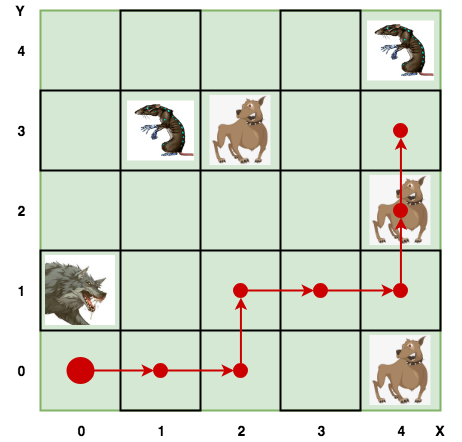
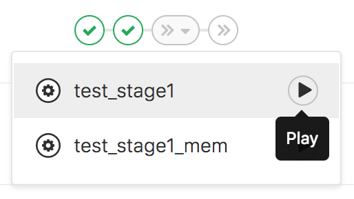

# Подготовительная программа на С/С++

## Домашнее задание №6
### Основное задание (stage1)
Необходимо реализовать игру - систему, которая:
 - считывает и создает игровую карту из входного файла;
 - предлагает игроку набор действий в зависимости от его позиции на карте;
 - принимает от игрока очередное действие (команду);
 - выводит различные сообщения заданного формата, связанные с игровым процессом;
 - завершает свою работу, если игрок умирает или на вход системе перестают поступать команды (кончается stdin).

### Сущности
- Игрок - обладает очками здоровья (HP, в начальный момент времени равно 100) и очками наносимого урона (DMG, голые руки имеют DMG = 1).
Может перемещаться по карте и биться с врагами.
- Карта - поле размером N x M, состоящее из ячеек. На ячейке может находится или игрок или враг.
Если игрок оказывается на ячейке, в которой находится враг, то начинается битва, пока один из противников не погибает.
- Враг - представлен тремя персонажами, обладающими уникальными именами, различными очками здоровья (HP) и урона (DMG).
- Кроме урона от голых рук (1) враги имеют базовый урон, таким образом **_общий урон от врага = базовый урон + оружие_** (голые руки в данном случае).
 - Волк `"wolf"`: HP=6, DMG=10 [+ 1];
 - Собака `"dog"`: HP=3, DMG=5 [+ 1];
 - Крыса `"rat"`: HP=2, DMG=3 [+ 1]. 

### Игровой процесс
В начале игры игрок находится на ячейке (0, 0).

Перед каждым ходом система выводит позицию игрока, его HP, а также доступные ему действия, и ожидает на вход очередного действия.

Формат вывода сообщения перед очередным ходом:
```
Supported actions:
 * <название_действия_1>
 * <название_действия_N>
<X> x <Y>, hp: <количество_очков_здоровья> >
```

Возможные действия (**_в порядке возможного вывода в сообщении перед очередным ходом_**):
- Пойти влево:   `"move left"`;
- Пойти вправо:  `"move right"`;
- Пойти вниз:    `"move down"`;
- Пойти вверх:   `"move up"`.

Если игрок попал на ячейку с врагом, то возможно только одно действие (**_битва описана ниже_**):
- Ударить врага: `"kick enemy"`.

Таким образом, начало игры выглядит так:
```bash
$ ./main.out --map my.map
Supported actions:
 * move right
 * move up
0 x 0, hp: 100 >
```
Игрок не может пойти влево, т.к. упирается в левую границу карты (ось ординат), не может пойти вниз,
так как упирается в нижнюю границу карты (ось абcцисс), но может пойти вверх или вправо (**см. порядок возможных действий**).

Врага на ячейке (0, 0) **_быть не может_**.

Система принимает действие, выполняет его, печатает ответ и следующие доступные для игрока действия.

Возможные ответы системы:
- Движение произведено: `"moved"`;
- Встретился враг:      `"<имя_врага> found, <количество_HP_врага> hp"`;
- Ударили врага:        `"enemy kicked. Enemy hp: <количество_оставшихся_HP_врага>"`;
- Убили врага:          `"enemy killed"`;
- Игрок умер:           `"player died"`.

Продолжим игру, начатую раньше, и пойдём вправо.
```bash
$ ./main.out --map my.map
Supported actions:
 * move right
 * move up
0 x 0, hp: 100 > move right
moved
Supported actions:
 * move left
 * move right
 * move up
1 x 0, hp: 100 >
```

#### Битва
Если игрок попал на ячейку с врагом, то они будут биться.

Битва будет продолжаться, пока не погибнет игрок или враг.

Удары идут последовательно: сначала бьёт игрок, уменьшая количество HP врага на число наносимого урона, затем бьёт враг, уменьшая HP игрока на число своего урона.

В примере ниже игрок на ячейке (4, 2) встретил собаку (с тремя очками здоровья), 
ударил её голыми руками (3HP - 1 = 2HP) и, получив в ответ укус на 6HP (5 + 1), остался с 94 HP.
```
dog found, 3 hp
Supported actions:
 * kick enemy
4 x 2, hp: 100 > kick enemy
enemy kicked. Enemy hp: 2
Supported actions:
 * kick enemy
4 x 2, hp: 94 >
```

### Карта
Файл карты имеет следующий формат:
```
<N> <M>
<координата_X> <координата_Y> <имя_врага_1>
<координата_X> <координата_Y> <имя_врага_N>
```

Карта передается программе с помощью ключа --map.

### Подробный пример игрового процесса
Имеем карту 5x5test.map:
```
5 5

4 0 dog
0 1 wolf
4 4 rat
4 2 dog
1 3 rat
2 3 dog
```



На карте нарисован маршрут, по которому мы хотим пройти игроком.

**_Обратите внимание на битву с собакой на ячейке (4, 2)!_**

Запуск игры и игра:
```bash
$ ./main.out --map 5x5test.map
Supported actions:
 * move right
 * move up
0 x 0, hp: 100 > move right
moved
Supported actions:
 * move left
 * move right
 * move up
1 x 0, hp: 100 > move right
moved
Supported actions:
 * move left
 * move right
 * move up
2 x 0, hp: 100 > move up
moved
Supported actions:
 * move left
 * move right
 * move down
 * move up
2 x 1, hp: 100 > move right
moved
Supported actions:
 * move left
 * move right
 * move down
 * move up
3 x 1, hp: 100 > move right
moved
Supported actions:
 * move left
 * move down
 * move up
4 x 1, hp: 100 > move up
dog found, 3 hp
Supported actions:
 * kick enemy
4 x 2, hp: 100 > kick enemy
enemy kicked. Enemy hp: 2
Supported actions:
 * kick enemy
4 x 2, hp: 94 > kick enemy
enemy kicked. Enemy hp: 1
Supported actions:
 * kick enemy
4 x 2, hp: 88 > kick enemy
enemy killed
Supported actions:
 * move left
 * move down
 * move up
4 x 2, hp: 88 > move up
moved
Supported actions:
 * move left
 * move down
 * move up
4 x 3, hp: 88 > 
```

### Дополнительное задание (stage2)

Реализовать для игрока возможность надевать одежду, обладающую уникальным именем, весом (WGT) и очками брони (ARM):
 - К характеристикам игрока добавляется максимально носимый вес одежды (20WGT);
 - Броня игрока - сумма очков брони всей одежды, которая на нём надета;
 - В битве очки урона нападающего "компенсируются" броней защищающегося. В случае, когда урон полностью гасится броней, защищающий получает 1 очко урона. Например:
   - Игрок имеет 3HP, 4ARM и получает 2DMG. У него остается 2HP (броня поглотила весь урон, поэтому игрок получил 1 очко урона);
   - Игрок имеет 10HP, 10ARM и получает 15DMG. У него остается 5HP (броня поглотила 10 очков урона, и игрок получил 5 очков урона).
 - Игрок не может носит две одинаковые вещи;
 - Список одежды, носимой игроком, **_отсортирован в лексикографическом порядке_**;
 - Возможная одежда и её характеристики:
  - Броня `"armor"`: WGT=3, ARM=3;
  - Шлем `"helmet"`: WGT=2, ARM=3;
  - Щит `"shield"`: WGT=7, ARM=5;
  - Штаны `"pants"`: WGT=1, ARM=1;
  - Футболка `"T-Shirt"`: WGT=1, ARM=1.

На ячейке может находиться только одна вещь. Одежда не может находиться на ячейке с врагом.

При попадании игроком на ячейку с одеждой, ему дополнительно к основным становятся доступны новые действия:
- Надеть вещь:   `"pick <имя_вещи>"`;
- Для каждой надетой игроком вещи в лексикографическом порядке:
 - Бросить вещь:  `"throw <имя_вещи>"`.

Соответственно ответы системы:
- Встретилась вещь: `"<имя_вещи> found"`;
- Вещь надета: `"clothes worn"`;
- Вещь брошена: `"the <имя_вещи> is thrown out"`.

Сообщение перед очередным ходом меняется - добавляется информация о броне:
```
<X> x <Y>, hp: <количество_очков_здоровья>, armor: <количество_очков_брони> >
```

**_ВАЖНО! Если вещь не надеть и уйти с клетки, то вещь теряется._**

##### Примеры
На ячейке (0, 18) найден щит. Надели его.
```
shield found
Supported actions:
 * move down
 * move up
 * pick shield
0 x 18, hp: 50, armor: 0 > pick shield
clothes worn
Supported actions:
 * move down
 * move up
0 x 18, hp: 50, armor: 5 >
```

На ячейке (0, 23) найдены штаны. Бросили щит и надели штаны.
```
pants found
Supported actions:
 * move down
 * move up
 * pick pants
 * throw shield
0 x 23, hp: 20, armor: 5 > throw shield
the shield is thrown out
Supported actions:
 * move down
 * move up
 * pick pants
0 x 23, hp: 20, armor: 0 > pick pants
clothes worn
Supported actions:
 * move down
 * move up
0 x 23, hp: 20, armor: 1 > 
```

На игроке надета броня, футболка и штаны. На ячейке (6, 2) был найден шлем.
```
helmet found
Supported actions:
 * move left
 * move right
 * move down
 * move up
 * pick helmet
 * throw T-Shirt
 * throw armor
 * throw pants
6 x 2, hp: 5, armor: 5 > 
```

### Тестирование
Основное задание - папка btests/testcases/**_stage1_**, дополнительное - папка btests/testcases/**_stage2_**.

Программа вызывается с указанием карты:
```bash
$ ./main.out --map btests/maps/stage1/1.map
```

На вход программе подается список действий для игрока вида:
```
move up
kick enemy
kick enemy
move down
move right
pick T-Shirt
move up
```

Одиночный тест:
```bash
$ ./btests/run.sh ./main.out -- btests/testcases/stage1/1.tst
$ ./btests/run.sh ./main.out -- btests/testcases/stage2/1.tst
```

Все тесты
```bash
$ ./btests/run.sh ./main.out --tests-path btests/testcases/stage1
$ ./btests/run.sh ./main.out --tests-path btests/testcases/stage2
```

Найти интересные тесты, чтобы посмотреть, какой вывод ожидается от программы:
```bash
$ grep -nR 'throw T-Shirt' btests/testcases/stage2
btests/testcases/stage2/15.tst: * throw T-Shirt
btests/testcases/stage2/17.tst:throw T-Shirt
btests/testcases/stage2/18.tst:throw T-Shirt
```

Карты, соответствующие тестам, лежат в *__btests/maps/stage__*.

### Оценка

- Первые 6 дней - максимально 10 баллов;
- 7 день - максимально 8 баллов;
- 8 день - максимально 5 баллов;
- 9 день - максимально 3 балла;

За выполнение дополнительного задания **_+ 6 баллов_**.

При открытии merge request'а необходимо вручную запустить тестирование задания (обычное - stage1, с дополнительным - stage2).

Кликаем test_stage1, а затем test_stage1_mem соответственно (аналогично для stage2).


