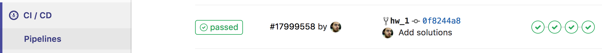

# Подготовительная программа на С/С++

## Домашнее задание №1
Вводное задание нашего курса, которое познакомит вас с нашей методикой приема ДЗ.

В папках **_project/include_** и **_project/src_** лежат исходники тестовой программы, которая через командную строку принимает следующие аргументы:
- **_номер кейса_** (целое число в диапазоне [1, 3]);
- входные данные для кейса:
  * для кейса 1 - **_строка_** (./main.out 1 'Hello world!');
  * для кейса 2 - **_два целых числа_** (./main.out 2 7 9);
  * для кейса 3 - **_целое число_** (./main.out 3 197).

Требуется:
1. Провести статический анализ кода: найти при помощи **_линтеров_** ошибки в стиле и исправить их.
2. Найти и исправить ошибку в кейсе №1.
    * Чем проще - тем лучше.
    * Для облегчения поиска ошибки можно собрать программу при помощи **_make_**'а и позапускать с различными параметрами.
3. Реализовать функцию кейса №2 по ее прототипу.
    * Функция возвращает результат возведения **_base_** в степень **_pow_**.
4. Реализовать модуль для кейса №3 и добавить его в основную программу.
    * Модуль должен содержать функцию, определяющую является ли число, поданное на вход, простым: если да - вернуть 1, иначе 0.
    * Описание модуля и его реализация должны лежать в соответствующих .h и .c файлах.
    * [Не забудьте добавить исходники в **_Makefile_**](#Как-добавить-исходные-коды-в-makefile).

**_Если вы нашли какие-либо неточности/ошибки или испытываете затруднения при решении - обращайтесь к преподавателям
(общий чат, сообщения на портале, на почту или в issues GitLab'а)._**

Если задание выполнено полностью верно, то после пуша в свою ветку на странице CI/Pipelines GitLab'а вы увидите 4 успешно прошедших этапа:
- тестирование стиля кода;
- сборка;
- тестирование собранного бинарника;
- тестирование собранного бинарника на наличие утечек памяти.



## Проверь себя!
Все команды, описанные ниже, выполняются из **_корневой_** директории проекта (один уровень с **_Makefile_**).

### Как собрать и запустить программу?
[Как использовать команды, подобные той, что ниже](#Использование-кодовых-вставок)
```bash
$ make clean && make
$ ./main.out 1 'Hello world!'
```

Не собирается:
- все ли ошибки, выявленные gcc, исправлены?
- все ли исходники указаны в **_Makefile_**?

### Как запустить статический анализ кода?
Статический анализ кода - это процесс выявления логических и стилистических ошибок в исходных файлах программ без их компиляции и исполнения.
Данный анализ избавляет программиста от багов, которые могут возникнуть вследствие его невнимательности. Программы, выполняющие статический анализ кода, называются **_статическими анализаторами_** или в простонародье - **_линтерами_**.

#### Необходимые зависимости
На вашей машине **_должны быть установлены_** утилита [cppcheck](http://cppcheck.sourceforge.net/) и [Python 2.7](https://www.python.org/download/releases/2.7/) (воспользуйтесь **_apt-get install_**).
```bash
$ cppcheck --version
Cppcheck 1.82
$ python2.7 --version
Python 2.7.13
```

#### Запуск линтеров
```bash
$ ./linters/run.sh --local

***** RUN cppcheck *****
Checking project/src/main.c ...
1/2 files checked 50% done
Checking project/src/utils.c ...
2/2 files checked 100% done
[*]: (information) Unmatched suppression: missingIncludeSystem

***** RUN cpplint.py *****
Done processing project/include/utils.h
Done processing project/src/main.c
Done processing project/src/utils.c
Total errors found: 0

***** SUCCESS *****
```

### Как запустить тесты?
```bash
$ make clean && make
$ ./btests/run.sh ./main.out
............SUCCESS
```

#### Тест не пройден. Причина?

##### Код возврата программы не совпадает с ожидаемым
```bash
$ ./btests/run.sh ./main.out 
TEST ./btests/0.0.tst FAILED. INVALID EXIT STATUS 
EXPECTED:
255
RECEIVED:
0
```
Мы видим, что тест ./btests/0.0.tst не прошёл.

Ожидалось, что программа завершится с кодом 255, а был получен 0.

##### Вывод программы не совпадает с ожидаемым
```bash
$ ./btests/run.sh ./main.out 
..TEST ./btests/1.0.tst FAILED 
EXPECTED (2 symbols):
12
RECEIVED (1 symbols):
8
```
Мы видим, что тест ./btests/1.0.tst не прошёл.

В стандартном выводе программы ожидалось "12", а было получено "8".

#####  Что делать?
Смотрим содержимое непрошедшего теста (**_файл .tst_**), узнаём с какими ключами (KEYS) была запущена программа, что было подано ей на вход (IN) и какой вывод (OUT) и код возврата (STATUS) ожидались.

Пробуем повторить тест руками.

## Дополнения

### Использование кодовых вставок
Все кодовые вставки в данном документе подчиняются следующим правилам:
#### Если перед строкой стоит знак **_$_**, значит это команда, которая запускается в терминале. Пример:
```bash
$ ls
$ ./test
```
Здесь выполняются 2 команды: **_ls_** и **_./test_**.
Чтобы выполнить их у себя на компьютере, необходимо скопировать все, что находится за символом **_$_**.
#### Если перед строкой не стоит символа **_$_**, значит это вывод программы, которая была выполнена выше. Пример:
```bash
$ ls
test 123 somedir
```
Здесь была выполнена команда **_ls_**, которая выдала в терминал текст **_test 123 somedir_**. Эти строки даны для
ознакомления с примером вывода программ.

### Как добавить исходные коды в Makefile
Если вы добавляете в проект еще один файл исходных кодов, для того чтобы он успешно собирался, необходимо добавить его в
файл **_Makefile_**.
Напомним, что **_Makefile_** является составным конфигурационным файлом для утилиты [make](https://www.gnu.org/software/make/).

Пример конфигурационного файла:
```Makefile
TARGET = main.out
HDRS_DIR = project/include

# XXX: Don't forget backslash at the end of any line except the last one
SRCS = \
       project/src/main.c \
       project/src/utils.c

.PHONY: all clean

all: $(TARGET)

$(TARGET): $(SRCS)
	$(CC) -Wall -Wextra -Werror -I $(HDRS_DIR) -o $(TARGET) $(CFLAGS) $(SRCS)

clean:
	rm -rf $(TARGET)
```

В данном примере, проект состоит из 2х файлов исходных кодов: **_project/src/main.c_** и **_project/src/utils.c_**.
В случае, если вам необходимо добавить еще один файл в проект, необходимо добавить путь к файлу в переменную **_SRCS_**.

Например, чтобы добавить файл **_project/src/some.c_**, отредактируйте **_Makefile_** следующим образом:
```Makefile
SRCS = \
       project/src/main.c \
       project/src/utils.c \
       project/src/some.c
```

Обратите внимание, что после **_utils.c_** появился знак переноса строки (символ **_/_**) тогда как после
**_some.c_** его нет. Знак переноса строки должен присутствовать во всех строках кроме последней.

Обратите также внимание на то, что в списке исходных текстов указываются только файлы с расширением **_.c_**.
Заголовочные файлы указывать в списке не нужно.
